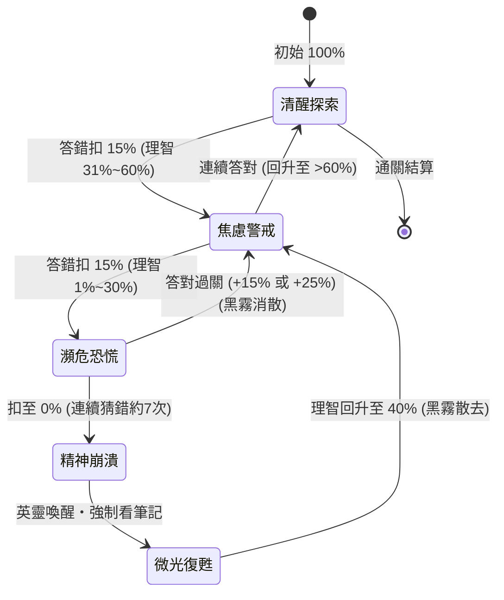

# 🏰 國小數學密室逃脫遊戲製作標準作業程序 (SOP)
> **Standard Operating Procedure for Educational Escape Room Games**  
> 本 SOP 總結自《數之咒印：禁忌地牢逃脫》（康軒六上數學第 03 單元《數量關係》）之實戰開發經驗，供後續各年級、各單元開發沈浸式數學密室闖關遊戲時遵循使用。

---

## 📑 目錄
1. [專案架構與檔案規劃](#1-專案架構與檔案規劃)
2. [第一階段：教材解構與題型映射](#2-第一階段教材解構與題型映射)
3. [第二階段：防抄襲參數與隨機引擎](#3-第二階段防抄襲參數與隨機引擎)
4. [第三階段：情境包裝與機關密碼鎖設計](#4-第三階段情境包裝與機關密碼鎖設計)
5. [第四階段：理智值 (Sanity HP) 與動態懲戒/獎勵機制](#5-第四階段理智值-sanity-hp-與動態懲戒獎勵機制)
6. [第五階段：學習鷹架筆記與 SVG 動態圖解](#6-第五階段學習鷹架筆記與-svg-動態圖解)
7. [第六階段：擬真人聲題目語音報讀系統 (TTS)](#7-第六階段擬真人聲題目語音報讀系統-tts)
8. [第七階段：雙語支援與通用 UI/UX 規範](#8-第七階段雙語支援與通用-uiux-規範)
9. [第八階段：通關結算證書與進度儲存](#9-第八階段通關結算證書與進度儲存)
10. [驗收清單與測試檢核表](#10-驗收清單與測試檢核表)

---

## 1. 專案架構與檔案規劃

為確保純靜態網頁（GitHub Pages）相容性、零外部套件依賴、高載入速度與後續可維護性，建議採用以下模組化目錄結構：

```text
games/[game-folder-name]/
├── index.html               # 遊戲主頁面與骨架
├── css/
│   └── escape.css           # 哥德暗黑風格樣式、動畫、遮罩與轉盤樣式
└── js/
    ├── prng.js              # 線性同餘種子隨機數生成器 (PRNG)
    ├── audio-manager.js     # Web Audio API 原生音效合成器 (心跳、石門、水晶鐘、警報)
    ├── questions.js         # 單元題庫引擎 (題目生成、動態數值、隨機洗牌、密碼格式化)
    ├── diagram-renderer.js  # 動態 SVG 幾何與圖形鷹架渲染器
    ├── lock-system.js       # 4位實體黃銅旋轉滾輪密碼鎖元件
    ├── tts-reader.js        # 擬真人聲神經語音報讀與文字淨化系統
    └── game-controller.js   # 遊戲主控制器 (關卡流轉、理智值、存檔、中英切換、結算)
```

---

## 2. 第一階段：教材解構與題型映射

### 步驟 2.1：課本與習作細目解構
1. **取得教材來源**：課本 PDF、教學指引、習作重點。
2. **抽取核心概念**：按小節依序列出學習重點（如 3-1 週期與公差、3-2 四大不變量、3-3 間隔植樹、綜合最大公因數）。
3. **規劃 8～10 個密室關卡**：
   - 前 30%：基礎辨識題（如圖形週期、規律找尋）。
   - 中 50%：核心運算與情境應用（如和差積商、直線間隔兩端放置）。
   - 後 20%：綜合高階挑戰（如封閉圖形、長寬四角最大公因數魔王關）。

### 步驟 2.2：設計解題密碼規範
- 每一題的最終計算結果必須映射為 **3～4 位純數字密碼**（如 `0135`、`0024`）。
- 若題目有小數（如 13.5），定義好代碼格式（如乘十變整數 0135，並於介面說明）。
- 保留計算精準度，避免無限循環小數（在生成器中過濾除得盡的數值對）。

---

## 3. 第二階段：防抄襲參數與隨機引擎

### 步驟 3.1：個人化專屬亂數種子（PRNG）
- **輸入依據**：學生輸入「班級」＋「座號」（如 `601-15`）。
- **種子機制**：使用 `SeededRandom`，相同座號產生確定性數值，不同座號數值完全不同。
- **動態範圍限制**：
  - 運算難度保持同一水平（如乘法維持兩位數乘一位數、間隔數維持 15～30）。
  - 避免產生負數或不合理現實情境數據（如年齡差題確保大者歲數合理）。

### 步驟 3.2：答題順序隨機洗牌（Fisher-Yates Shuffle）
- 每次新局登入時，10 道密室題目進行隨機重排。
- **動態編號適配**：
  - 第 1 抽出之題目自動賦予「第一密室：[主題]」、「關卡 1 / 10」。
  - 第 10 抽出之題目自動賦予「第十密室 (魔王脫出)：[主題]」。
- **防重整跳題**：將當前洗牌後的順序陣列 `chamberOrder` 存入 `localStorage`，重新整理網頁時維持該局排列，登出才重洗。

---

## 4. 第三階段：情境包裝與機關密碼鎖設計

### 步驟 4.1：沈浸式情境故事包裝
- 拋棄傳統死板的「小明買了 5 顆蘋果」，轉換為哥德地牢、古代神廟或神秘探險：
  - 骨杖連續相連 ➡️ **骸骨牢籠的幾何生長**
  - 晝夜時數和為 24 ➡️ **雙子血月的平衡之秤**
  - 水槽排水 ➡️ **毒液水牢的逆流閥門**
  - 植樹間隔 ➡️ **幽靈長廊的冥燈指引**
- 故事文案末尾自然帶出數學問題，讓情境與計算合而為一。

### 步驟 4.2：實體 4 位黃銅滾輪密碼鎖（Antique Brass Lock）
- **外觀特徵**：金屬拉絲質感、古典刻度窗、滾動陰影。
- **互動支援**：
  - 支援滑鼠點擊上下按鈕滾動（▲ / ▼）。
  - 支援鍵盤方向鍵、數字鍵直接鍵入。
  - 滾動時觸發機械齒輪喀噠聲（`playDialTick()`）。
  - 輸入正確時觸發厚重石門推開轟鳴聲（`playStoneDoor()`）。

---

## 5. 第四階段：理智值 (Sanity HP) 與動態懲戒/獎勵機制

理智值是維持緊張氛圍與教學激勵的核心樞紐，採「5 階段狀態流轉」：



### 步驟 5.1：扣除與黑霧手電筒遮罩
- **每次答錯**：扣除 15% 理智，觸發畫面劇烈震動（Screen Shake）與惡靈嘲弄。
- **理智 ≤ 30%（瀕危恐慌）**：
  - 啟動 **115 BPM 急促心跳聲**。
  - 畫面啟動 **手電筒暗黑遮罩（Torchlight Vignette）**，全螢幕黑霧籠罩，僅有鼠標/觸控周圍半徑約 380px 的光暈探照石壁與鎖栓。

### 步驟 5.2：0% 昏厥與微光復甦（重獲光明）
- 理智跌至 0% 時判定昏厥。
- **強制彈出「📖 染血筆記本」**，要求學生研讀觀念。
- 理智**自動回升至 40%**。因 40% > 30%，**手電筒暗黑遮罩自動消散解除，密室重見光明**，提供舒適清晰的讀題視野。

### 步驟 5.3：答對理智恢復（方案 3：精準解鎖加成）
- **0 次失誤過關**（一次成功）：理智 **＋25%**（鼓勵草稿算好再撥鎖）。
- **1 次失誤後過關**：理智 **＋15%**。
- **2 次以上失誤才過關**：理智 **＋10%**（保底喘息）。
- 理智條觸發**聖潔綠光脈衝特效**，並播放清脆水晶升調鐘聲（C5-E5-G5-C6 Chime）。
- 若從 ≤ 30% 回升至安全區，即刻提示：`☀️ 驅散黑暗，視野重現光明！`

---

## 6. 第五階段：學習鷹架筆記與 SVG 動態圖解

### 步驟 6.1：嚴禁直接給予答案
- 筆記本內容以**概念引導**、**公式方向**為主（例如：「公式引導：1 ＋ 3 × N ＝ ？（請動手計算）」）。
- 標註常見易錯陷阱（如「兩端都放要加 1」、「道路兩側要乘以 2」、「相鄰共用邊不能重複乘」）。

### 步驟 6.2：純 SVG 動態幾何圖解
- 由 `diagram-renderer.js` 動態產生與該題數值相符的向量圖：
  - **火柴棒/骨杖增長圖**：動態繪出前 3 個圖形並標出共用邊。
  - **數線圖**：繪出起點號碼、終點號碼與間隔弧線。
  - **封閉圓形圖**：展示頭尾重合的間隔與柱子對應。
  - **長方形陣眼**：標出長、寬與四個角落標記。

---

## 7. 第六階段：擬真人聲題目語音報讀系統 (TTS)

### 步驟 7.1：神經擬真人聲智能評分選擇
Web Speech API 預設常挑選到 Windows 20 年前陳舊的 SAPI5 機械聲音（如 Hanhan Desktop），必須透過評分演算法篩選：
1. **最高優先（中文）**：微軟自然神經語音 `Microsoft HsiaoChen Online (Natural)` / `YunJhe Online (Natural)`、Google 臺灣國語神經語音、Apple Siri / 美佳。
2. **最高優先（英文）**：`Microsoft Jenny Online (Natural)` / `Guy Online (Natural)`、Google US English、Apple Samantha。
3. **強制扣分/封鎖**：名稱帶有 `desktop`、`hanhan`、`david`、`zira` 之離線機械語音。

### 步驟 7.2：教師讀題級「文字自然淨化」
在送進 TTS 前進行口語化預處理：
- **移除括號操作指示**：去除 `（若為小數如 13.5，密碼請輸入 0135）` 等介面提示。
- **移除圖示與外框標點**：過濾 Emojis、`【】`、`『』`、`「」`，避免逐字唸出「上引號」、「方括號」。
- **單位與數學符號口語化**：
  - 中文：`120m` ➡️ `120公尺`、`9.5 hrs` ➡️ `9.5小時`、`÷` ➡️ `除以`、`⋯⋯` ➡️ `依此類推`、冒號 ➡️ 逗號自然停頓。
  - 英文：`#25` ➡️ `number 25`、`120m` ➡️ `120 meters`、`gcd` ➡️ `greatest common divisor`。
- **去除結尾重複題目**：密室情境末尾已包含問題，無需贅述「機關謎語：...」。

### 步驟 7.3：自然換氣分句隊列（Sentence Queue）
- 依 `。！？!?` 將長文切分為短句。
- 逐句發音並在句間加入 **200ms 自然換氣停頓**。
- 徹底避開 Chromium 核心超過 15 秒語音自動凍結中斷之底層 Bug。

---

## 8. 第七階段：雙語支援與通用 UI/UX 規範

### 步驟 8.1：真雙語無縫切換（非中英並排）
- 畫面提供 `🌐 English` / `🌐 中文` 一鍵切換。
- 所有故事、題目、筆記、標題、按鈕、結算證書皆由資料模型提供 `_zh` 與 `_en`，畫面純粹呈現單一語言，拒絕混雜並排造成視覺疲勞。

### 步驟 8.2：簡潔頂部導覽列
- 按鈕文字簡明化：`🚪 登出`、`🔊 朗讀`、`📖 染血筆記`、`🌐 English`。
- 學生標籤簡潔化：僅顯示 `👤 [學生暱稱]`，移除宂長的班級座號前綴。

---

## 9. 第八階段：通關結算證書與進度儲存

### 步驟 9.1：生還脫出證書（Certificate）
- 彙整通關數據：總耗時（分秒）、剩餘理智值、總失誤次數。
- **評星與榮譽稱號**：
  - ⭐⭐⭐ **傳奇破咒大師**：理智 ≥ 80% 且失誤 ≤ 3 次。
  - ⭐⭐ **沉著解謎先驅**：理智 50%～79%。
  - ⭐ **歷劫生還勇者**：理智 < 50%（若剩餘理智 ≤ 30% 標紅警告）。
- 提供「🖨️ 列印/截圖留存」、「🔄 再次挑戰」、「🏠 返回學習大廳」按鈕。

### 步驟 9.2：本地進度持久化（LocalStorage）
- 儲存內容：`studentInfo`、`sanity`、`currentChamberIdx`、`startTime`、`chamberOrder`、`wrongCount`、`chamberWrongCount`。
- 通關或登出時清除儲存，確保下一局能夠全新開始。

---

## 10. 驗收清單與測試檢核表

在將下一個密室逃脫專案交付給學生之前，逐項進行以下確認：

- [ ] **題型正確性**：10 道題目是否完全對應課本單元教學重點？算式數字是否皆能整除且無循環小數？
- [ ] **防抄襲驗證**：輸入座號 01 與座號 02，兩者的題目數字與開鎖密碼是否完全不同？
- [ ] **隨機洗牌**：登出後重新進入，題目的出現順序是否隨機改變？關卡標題序號是否動態正確更新？
- [ ] **轉盤開鎖**：輸入正確密碼石門是否推開並進入下一關？輸入錯誤是否震動扣除 15% 理智？
- [ ] **暗黑手電筒**：理智降至 ≤ 30% 時，手電筒光暈是否正常跟隨滑鼠？按鈕與轉盤是否仍能點擊？
- [ ] **微光復甦**：理智歸零昏厥時，是否自動打開筆記？理智回升至 40% 時，黑霧是否徹底消散？
- [ ] **答對恢復**：0 次失誤過關是否 +25%、有失誤是否 +15%/+10%？是否有綠光與水晶鐘聲？
- [ ] **語音朗讀**：中英文發音是否為自然人聲而非機械音？是否濾除標點與代碼？
- [ ] **中英切換**：切換語言時是否全介面切換？文字與筆記是否有缺漏或中英混雜？
- [ ] **通關證書**：完成第 10 關是否正常結算？星級與玩家暱稱是否正確列印？

---
*文件編制日期：2026 年 10 月・密室逃脫教學開發組*
